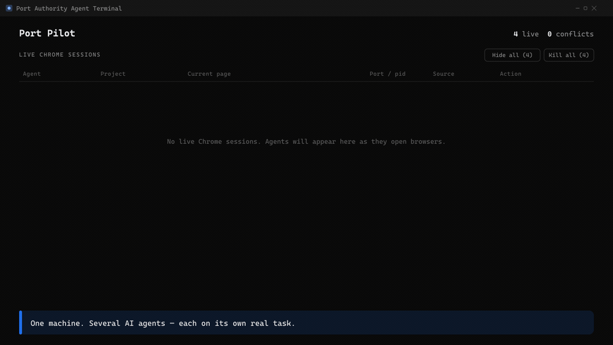

<p align="center">
  
</p>

# Port Authority Agent Terminal (`PAAT`)

> **Air-traffic control for the AI agents that use your web browser.**
> Give Claude, Codex, Cursor and friends each their own Chrome, with its own
> port, profile, and window, so they never collide on the same machine.

A fast-growing share of what happens in a web browser is now driven by AI
agents, not people. They log into sites, fill out forms, shop, and pull data,
and to do any of it they each need to drive a real Chrome browser. Run several
agents on one machine and they start fighting over the same browser: one ends up
steering another's window, breaks a login, or reports on the wrong page.

`PAAT` is a small CLI, MCP server, and native dashboard you run locally. Before
any agent opens a browser, it asks `PAAT` for a **lane**: its own app port, its
own Chrome remote-debugging port, and its own dedicated Chrome profile. `PAAT`
then guarantees, on every check, that an agent only ever attaches to the Chrome
running its own profile, never a sibling agent's.

<p align="center">
  
  <br/>
  <em>Four agents (Cloudflare API keys, AWS IAM, eBay, Newegg), each in its own isolated Chrome lane on one live dashboard. &nbsp;<a href="assets/demo.mp4">▶ Watch as video (MP4)</a></em>
</p>

[]()
[](https://github.com/charlesonogwu/port-authority-agent-terminal/actions)
[](https://www.npmjs.com/package/port-authority-agent-terminal-mcp)
[](LICENSE)

---

## Install

**Prereq:** Node.js ≥ 20 (from <https://nodejs.org/>).

```
npm install -g port-authority-agent-terminal-mcp
```

Pre-built, ~5 seconds, no build step. You get three interchangeable CLI aliases
(`paat`, `port-authority`, `portpilot`, all the same binary), a dashboard you
open with `paat dashboard`, and the MCP server auto-wired into Claude Desktop /
Codex Desktop / Claude Code if any are installed. Upgrading is the same command.

<details>
<summary>Other ways to install</summary>

- **From GitHub `main`** (bleeding edge; builds on your machine, needs `git` + Rust):
  `npm install -g github:charlesonogwu/port-authority-agent-terminal`
- **PowerShell installer** (also runs `paat config init` + prints next steps; add `-Autostart` to start at login):
  `iwr -useb https://raw.githubusercontent.com/charlesonogwu/port-authority-agent-terminal/main/scripts/install.ps1 | iex`

</details>

> **Platform.** Windows 10/11 is the officially tested target. macOS/Linux
> fallback branches exist but aren't covered by CI. PRs welcome.

---

## The problem

Run more than one local AI agent and they collide. Two agents both reach for
Chrome debug port `9222` (the port every CDP tutorial uses), and the second
**silently attaches to the first one's browser**. It tests the wrong app,
inherits stale cookies, overwrites work. You only notice when an agent
confidently reports "the homepage looks great" about a different repo. Worse,
two agents sharing one `--user-data-dir` **corrupt each other's profile**:
Chrome's SingletonLock breaks, sessions invalidate, extensions reset.

`PAAT` hands each `(agent, project)` pair a separate **lane** so that never
happens.

## What a lane is

| Field             | What it is                                                            |
|-------------------|-----------------------------------------------------------------------|
| `owner`           | Which agent: `claude`, `codex`, `gemini`, `cursor`, `copilot`, …       |
| `project`         | Slug derived from the project directory                               |
| `cwd`             | Absolute project working directory                                    |
| `appPort`         | A free port in the app range (default `3000-3099`)                    |
| `chromeDebugPort` | A free port in the Chrome debug range (default `9322-9399`)           |
| `chromeProfileDir`| Dedicated `--user-data-dir` (persists logins across sessions)         |
| `sessionId`       | Optional: lets one agent run several Chromes in the same project       |
| `status`          | `reserved` → `active` → `stale` → `released`                          |

Lanes live in `~/.portpilot/lanes.json`, guarded by a lockfile so concurrent
writes can't corrupt the registry.

## Wire it into your agents

The installer auto-wires the MCP server into Claude Desktop / Codex Desktop /
Claude Code. To do it by hand, add this block to the desktop's config.

**Claude Desktop**, in `%APPDATA%\Claude\claude_desktop_config.json`:

```json
{ "mcpServers": { "paat": { "command": "paat", "args": ["mcp"] } } }
```

**Codex Desktop**, in `~\.codex\config.toml`:

```toml
[mcp_servers.paat]
command = "paat"
args = ["mcp"]
```

Restart the app and the agent has these tools: `open` (reserve + launch +
navigate in one call, the one to reach for), plus `reserve_lane`, `check_lane`,
`release_lane`, `launch_chrome_lane`, `list_lanes`, `find_free_lane`,
`scan_ports`, and `doctor`.

Then a prompt like *"Open https://example.com via PAAT in this folder"* just works:
the agent calls `open` and the session appears on the dashboard.

## Chrome launch modes

`open` and `launch_chrome_lane` (and `paat launch-chrome`) take a `mode`:

| Mode | Window | Use it for |
|---|---|---|
| `visible` *(default)* | Normal window on your desktop | Manual steps: logging in, solving a captcha |
| `background` | **Real headed Chrome rendered fully off-screen.** Never appears on a monitor, never steals focus | Non-interactive read/click automation. Same cookies, extensions, and anti-bot fingerprint as a normal browser. |
| `headless` | No window (`--headless=new`) | Lowest footprint, but many sites detect and block headless Chrome. |

Set a machine-wide default with `chromeMode` in `~/.portpilot/config.json` or the
`PORTPILOT_CHROME_MODE` env var. Precedence: **per-call `mode` > env var > config
> `visible`**.

> **Background-mode contract:** to keep the window off-screen, your CDP client
> must not call `Page.bringToFront()` or `Browser.setWindowBounds` with on-screen
> coordinates, since both re-raise the window. Read and click freely; just don't
> re-home the window.

## Drop-in prompt for your agents

Running several agents across different folders? Paste this into any of them
(system prompt, `CLAUDE.md`, `AGENTS.md`, or a one-off message):

```text
This machine runs multiple AI agents in parallel across different project
folders. Whenever a task here needs to drive a real Chrome browser (logging
into a site, scraping, clicking through a web app or dashboard, or any
DevTools-Protocol / puppeteer-core / Playwright-over-CDP automation), go
through PortPilot instead of launching Chrome yourself on a hardcoded debug
port. PortPilot hands you your own debug port and an isolated Chrome profile
so you never collide with another agent's browser, and the human can watch
every live session on a dashboard.

How to use it:

1. Claim a browser in one call. Use the `open` MCP tool with:
   - owner: identify WHICH LLM YOU ARE and pass that name only. If you are
     Claude use "claude", if you are Codex use "codex", likewise "cursor",
     "gemini", "windsurf", "copilot", etc. This is how the dashboard shows the
     human which model is driving each browser, so be honest about your own
     identity. No suffixes, batch numbers, or task IDs; put any per-task
     distinction in sessionId instead.
   - cwd: this project's absolute path.
   - url (optional): the first page to open.
   - mode: "background" for non-interactive read/click automation (a real
     headed Chrome that stays off-screen and never steals focus); "visible"
     when a human must log in or solve a captcha; "headless" only if you know
     the target site allows it.
   - sessionId (optional): only when you need several separate browsers in
     this same project at once.
2. Connect your CDP client (puppeteer-core browserURL, Playwright
   connectOverCDP) to http://127.0.0.1:<chromeDebugPort> from the response.
3. Respect the safety verdict: if check_lane returns unsafe-foreign-chrome or
   unsafe-unknown, that port belongs to another agent, so back off, do not
   attach, and never force-kill someone else's Chrome.
4. Background-mode rule: if you launched in "background" mode, do NOT call
   Page.bringToFront() or Browser.setWindowBounds with on-screen coordinates,
   since both yank the window onto the user's screen.
5. Release when finished: call release_lane (it does not kill Chrome).

No PortPilot MCP tools in this agent? Use the CLI instead:
   paat reserve --owner <you> --cwd "<path>"
   paat launch-chrome --owner <you> --cwd "<path>" --mode background
then connect to the printed debug port. `paat dashboard` opens the live view.
```

The whole point is composability: every agent passes `owner = <its own name>`
and `cwd = <its own folder>`, and PortPilot keeps their browsers (ports,
profiles, and focus) from ever stepping on each other.

## Real-world recipes

How `PAAT` actually gets used. Two patterns cover most of it.

### Recipe 1: Log in once, automate for hours

The most common flow. An agent has to drive a site behind a login it can't (or
shouldn't) do itself, like a marketplace seller dashboard, a SaaS console, or an
account gated by SMS / billing / identity screens.

1. The agent opens a **visible** lane: `open` with `owner=<llm>`, `cwd=<project>`,
   a `sessionId` for the task, the login/settings `url`, and `mode="visible"`.
   A real Chrome window appears.
2. **The human logs in once** in that window, including any first-time
   verification (phone, bank, captcha) the agent must not touch.
3. The agent connects to the lane's debug port and drives the page over CDP:
   reads the DOM, clicks, fills forms, uploads files.
4. **It keeps working.** The lane's dedicated profile is persistent, so the login
   survives across agent sessions. Come back hours later, reattach to the same
   debug port, still signed in, no re-auth.

The human does the one thing only a human can; the agent does everything else,
indefinitely, without ever clobbering another agent's browser.

### Recipe 2: Raw CDP, no framework required

You don't need Puppeteer or Playwright. Every lane exposes a standard Chrome
DevTools-Protocol endpoint at `http://127.0.0.1:<chromeDebugPort>/json`, so a
dozen lines in any language is enough:

```python
import requests, json, asyncio, websockets

PORT = 9322  # the chromeDebugPort PAAT assigned this lane

async def run(expr):
    tabs = requests.get(f"http://127.0.0.1:{PORT}/json", timeout=5).json()
    page = next(t for t in tabs if t["type"] == "page")
    async with websockets.connect(page["webSocketDebuggerUrl"]) as ws:
        await ws.send(json.dumps({"id": 1, "method": "Runtime.evaluate",
            "params": {"expression": expr, "returnByValue": True, "awaitPromise": True}}))
        print(json.loads(await ws.recv()))

asyncio.run(run("document.body.innerText"))
```

The debug-port URL is a stable contract: read the DOM, click buttons, set file
inputs (`DOM.setFileInputFiles`), or synthesize real keystrokes
(`Input.insertText`) for stubborn framework-driven forms that ignore programmatic
value writes. This is the reliable fallback when a browser-automation extension
isn't connected.

### Tips from the field

- **`stale` ≠ dead.** A lane can read `stale` (the owning agent hasn't checked in)
  while its Chrome is alive and the debug port still answers. Before re-opening,
  probe `http://127.0.0.1:<port>/json/version`. If it responds, just reattach.
  Re-opening would spin up a fresh, logged-out profile and lose the session.
- **One tab, navigate in place.** `window.open` is popup-blocked without a user
  gesture. To visit another page mid-task, set `location.href` and come back via
  a stable URL (a draft link, a permalink) rather than juggling tabs.
- **Headed beats headless for real sites.** Many sites block `--headless`. Use
  `mode="background"` for a real headed browser that renders off-screen, with the
  same fingerprint as a normal window, but nothing pops up or steals focus.

## Safety contract

| Verdict from `check_lane` | Meaning |
|---|---|
| `safe-free`              | Debug port is free. You may launch Chrome with this lane's profile. |
| `safe-attach`            | Debug port holds Chrome **with the matching profile**. You may attach. |
| `unsafe-foreign-chrome`  | Debug port holds Chrome with a *different* profile. **Do not attach.** |
| `unsafe-unknown`         | Debug port holds a non-Chrome process. **Do not attach.** |

`unsafe-*` verdicts make `paat check` exit 3 and `launch-chrome` / `open` refuse.
**`PAAT` never kills a process on its own.** The dashboard's manual Kill button is
the only path to termination, and it refuses anything that isn't Chromium-family.

## CLI

| Command | Purpose |
|---|---|
| `paat list`                               | List every lane |
| `paat status`                             | List + live port observations + warnings |
| `paat reserve --owner <n> --cwd <p> --task <s>` | Reserve a lane (idempotent per owner+cwd+session) |
| `paat check --owner <n> --cwd <p>`        | Verify the lane is safe to use right now |
| `paat release --owner <n> --cwd <p>`      | Release a lane (does NOT kill Chrome) |
| `paat launch-chrome --owner <n> --cwd <p> [--mode visible\|background\|headless]` | Launch Chrome bound to the lane |
| `paat next [--range 9322-9399]`           | Print the next free port in a range |
| `paat doctor`                             | Audit registry vs. live ports |
| `paat prune [--all] [--older-than 24h]`   | Garbage-collect released lanes |
| `paat config show` / `config init`        | Show / regenerate per-machine config |
| `paat dashboard`                          | Open the live dashboard |
| `paat mcp`                                | Run as an MCP stdio server |

Add `--json` to any command for machine-readable output.

## Live dashboard

`paat dashboard` (or the desktop shortcut) opens a native window listing every
live lane: one row per Chrome process, grouped by project, with the owner agent,
debug port, current tabs, and a click-to-confirm **Kill** button that refuses
non-Chrome PIDs. It polls a few times a minute and pauses while minimized, so it
costs nothing when you're not looking. No browser tab, no localhost server.

## Storage layout

```
~/.portpilot/
├── config.json     # per-machine cap, port ranges, default chrome mode
├── lanes.json      # the lane registry, single source of intent
├── lanes.json.lock # exclusive lock for safe concurrent writes
└── profiles/       # one persistent Chrome --user-data-dir per lane
```

Override the location with `PORTPILOT_HOME=<path>`.

## Building from source

```powershell
git clone https://github.com/charlesonogwu/port-authority-agent-terminal.git
cd port-authority-agent-terminal
npm install
npm run build      # CLI + MCP + native dashboard (the dashboard needs Rust)
npm link           # exposes paat / port-authority / portpilot on PATH
```

Just want the CLI + MCP without the dashboard? `npm run build:server` (TypeScript
only, no Rust). `npm test` runs the full suite (220+ tests covering the allocator,
registry, lockfile, Chrome safety verdicts, prune semantics, security validators,
and end-to-end CLI integration).

## Architecture

```
src/
  core/        lane types, paths, lockfile, registry, port scanner,
               Chrome safety verdicts + launch planning, allocator, config
  cli/         argument parsing + command dispatch
  dashboard/   live snapshot builder, agent inference, Chrome kill/focus/launch
  mcp/         MCP stdio server exposing the same core lib
gui/           native Tauri dashboard (React + Vite frontend, Rust shell)
scripts/       install.ps1, build helpers, postinstall
tests/         node:test suites
```

## Contributing

Bug reports, ideas, and PRs welcome. See [CONTRIBUTING.md](CONTRIBUTING.md).

## Changelog

See [CHANGELOG.md](CHANGELOG.md).

## License

[MIT](LICENSE)
